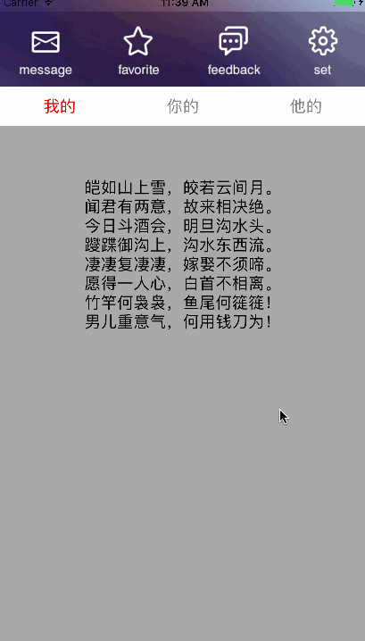

### UIScrollView中的TabBar特效

#### 特点在于:

__解决多个tableView与ScrollView滚动的手势冲突__

#### 如何接入：

添加TYZRichTabView文件夹下Source至工程

接入方法:

	_richTabView = [[TYZRichTabView alloc] initWithFrame:CGRectMake(0, 0, S_W, S_H)];
	_richTabView.delegate = self;
	[self.view addSubview:_richTabView];

#### 如何使用：

按需实现如下代理:

	#pragma mark -TYZRichTabViewDelegate
	- (NSInteger)numberOfSubViews;
	- (CGFloat)heightOfHeaderView;
	- (UIView *)headerView;
	- (NSArray *)tabTitles;
	- (id)richTabView:(TYZRichTabView *)richTabView viewForIndex:(NSInteger)index;
	- (void)richTabView:(TYZRichTabView *)richTabView scrollTo:(NSInteger)index;
	
	#pragma mark -ContentTableView
	- (NSInteger)richTabView:(TYZRichTabView *)richTabView numberOfSectionsInTableView:(UITableView *)tableView index:(NSInteger)index;
	
	- (NSInteger)richTabView:(TYZRichTabView *)richTabView tableView:(UITableView *)tableView numberOfRowsInSection:(NSInteger)section index:(NSInteger)index;
	
	- (CGFloat)richTabView:(TYZRichTabView *)richTabView tableView:(UITableView *)tableView heightForRowAtIndexPath:(NSIndexPath *)indexPath index:(NSInteger)index;
	
	- (UITableViewCell *)richTabView:(TYZRichTabView *)richTabView tableView:(UITableView *)tableView cellForRowAtIndexPath:(NSIndexPath *)indexPath index:(NSInteger)index;
	
	- (void)richTabView:(TYZRichTabView *)richTabView tableView:(UIScrollView *)tableView scrollWithIndex:(NSInteger)index;
	@end
